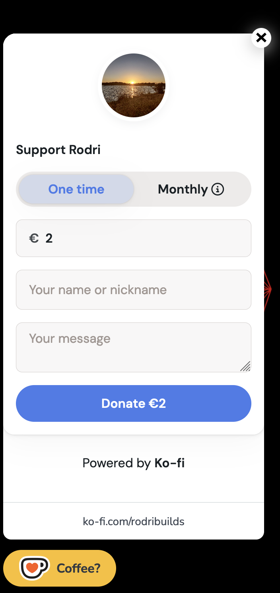

# kofi-react-widget

React floating button component to accept donations to your Ko-fi account without leaving your app. Works on both Next.js and pure React apps.
Check below for examples.

## Usage

    import { KofiFloatingButton } from "kofi-react-widget";
    
    export default YourComponent() {
        ...
        return (
        ...
        <KofiFloatingButton username="rodribuilds" background="#fbbf24" textColor="#323842" text="Coffee?" />
        )
    }
    
### Props

| Name          |                 Description        |     Type      |   Mandatory   | Default
| ------------- |------------------------------------| ------------- | ------------- | --------
| username      |Your Ko-fi username                 |     string    |     true      | ---
| background    |Button background color (HEX value) |     string    |    false      | #00b9fe
| textColor     |Button text color (HEX value)       |     string    |    false.     | #FFF

## Examples

You can see a working example [here](https://kinggizzardlastrelease.vercel.app/).

